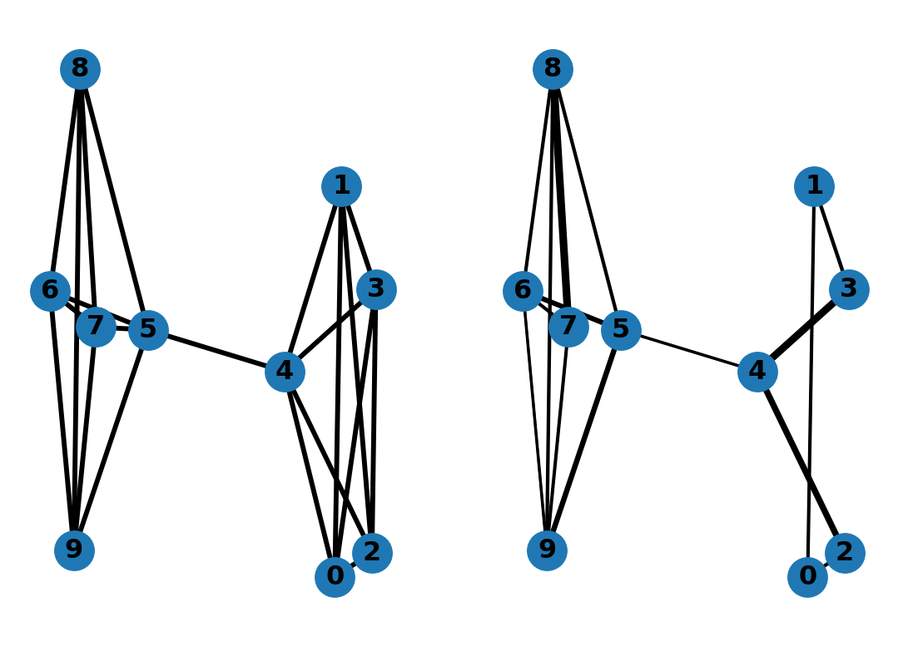

# Twice Ramanujan Sparsifiers

Based on the paper [Twice-Ramanujan Sparsifiers](https://arxiv.org/abs/0808.0163) we have implemented a spectral sparsification algorithm that produces graphs with the number of edges being almost linear.

You can check out the full description of the algorithm on the [repository website](https://hamidrezakmk.github.io/twice-ramanujan-sparsifiers/docs/).



## Setup
In a python (>=3.9) environment, run the following commands:
```bash
git clone https://github.com/HamidrezaKmK/twice-ramanujan-sparsifiers.git # clone the repository
cd src
pip install -r requirements.txt # install dependencies
```

## License

This project is licensed under the MIT License - see the [LICENSE](LICENSE) file for details


